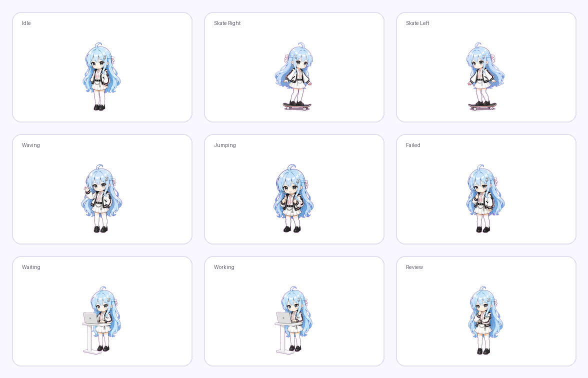

# OC Codex Pet Maker Skill

[English](README.md) | [中文](README.zh-CN.md)

把你的 OC、虚拟形象或头像概念，制作成可以在 Codex 桌面端使用的小宠物。这个项目整理了一套可复用流程：状态规划、角色参考图、动画横条、自动切图、质量检查、Spritesheet 打包和本地安装。

这个仓库包含：

- Codex Skill 入口：[`skill/SKILL.md`](skill/SKILL.md)
- 用于切图和打包的 Python 脚本
- 中英文制作指南
- 一个完整的 Lanxi 示例宠物包

## 效果展示

查看 Lanxi 中文展示页面：

[`docs/index.zh-CN.html`](docs/index.zh-CN.html)



## 快速开始

Python 脚本依赖 Pillow：

```bash
python3 -m pip install Pillow
```

### 1. 安装 Skill

把 `skill/` 目录复制到 Codex 的 skills 目录：

```bash
mkdir -p ~/.codex/skills/oc-codex-pet-maker
cp -R skill/* ~/.codex/skills/oc-codex-pet-maker/
```

然后新开一个 Codex 对话，可以这样说：

```text
Use the OC Codex Pet Maker skill to help me create a Codex pet for my OC.
```

Skill 应该先向你说明 Codex 宠物的 9 个状态，并帮助你确认每个状态对应的动作方案，然后再开始生成图片。

### 2. 制定状态动作方案

Codex 宠物通常有 9 个动画状态：

| 行 | 状态 | 含义 |
| --- | --- | --- |
| 0 | `idle` | 默认待机 |
| 1 | `running-right` | 向右拖拽或移动 |
| 2 | `running-left` | 向左拖拽或移动 |
| 3 | `waving` | 打招呼 |
| 4 | `jumping` | 跳跃或开心反馈 |
| 5 | `failed` | 任务失败或可恢复错误 |
| 6 | `waiting` | 等待用户输入或确认 |
| 7 | `running` | 任务处理中，不是字面意义的跑步 |
| 8 | `review` | 检查、审阅结果 |

可以使用这个模板：

[`templates/state-action-plan.template.md`](templates/state-action-plan.template.md)

### 3. 生成并切分动画横条

每一行动画可以先生成一张横向 sprite strip，再用脚本切成透明的 `192x208` 小格：

```bash
python3 scripts/cut_strip_to_cells.py \
  --src path/to/source-strip.png \
  --prefix output-prefix \
  --frames 8 \
  --mode smart-components \
  --key-color ff00ff \
  --key-tolerance 120 \
  --component-padding 22
```

重点检查这些输出：

```text
<prefix>-cell-preview.png
<prefix>-preview.gif
<prefix>-metrics.json
```

### 4. 合成最终 Spritesheet

准备好 9 行通过检查的动画横条后，创建 manifest，再合成最终图集：

```bash
python3 scripts/compose_spritesheet.py \
  --manifest examples/lanxi/rows-manifest.json \
  --out 40-draft-package/spritesheet.png \
  --webp-out 40-draft-package/spritesheet.webp
```

验证宠物包：

```bash
python3 scripts/validate_pet_package.py --package-dir 40-draft-package
```

## 为什么需要这个项目

制作一个好看的 Codex 宠物，比制作一张漂亮插画更脆弱。最终宠物需要同时满足：

- 每格只有 `192x208`
- 9 个不同应用状态
- 干净的透明背景
- 长发、大动作和道具不能被裁切
- 每行动画要稳定一致
- 最后必须打包成 `spritesheet.webp`

我们在制作 Lanxi 时踩过的最大坑之一，是 AI 生成的横条里每一帧距离太近。结果切图时，上一帧的头发会被切到下一帧里。这个项目提供了间距规范和 `smart-components` 切图模式，用代码识别真实角色边界，减少头发、衣服或道具串帧的问题。

## 文档

- English guide: [`docs/CODEX_PET_CREATION_GUIDE.md`](docs/CODEX_PET_CREATION_GUIDE.md)
- 中文制作指南：[`docs/CODEX_PET_CREATION_GUIDE.zh-CN.md`](docs/CODEX_PET_CREATION_GUIDE.zh-CN.md)
- Sprite 横条间距规则：[`docs/SPRITE_STRIP_SPACING_RULES.md`](docs/SPRITE_STRIP_SPACING_RULES.md)
- GitHub 发布经验：[`docs/GITHUB_PUBLISHING_NOTES.zh-CN.md`](docs/GITHUB_PUBLISHING_NOTES.zh-CN.md)
- Roadmap：[`docs/ROADMAP.md`](docs/ROADMAP.md)

## 仓库结构

```text
oc-codex-pet-maker/
  skill/
    SKILL.md
  scripts/
    cut_strip_to_cells.py
    compose_spritesheet.py
    validate_pet_package.py
  templates/
    state-action-plan.template.md
  docs/
    CODEX_PET_CREATION_GUIDE.md
    CODEX_PET_CREATION_GUIDE.zh-CN.md
    GITHUB_PUBLISHING_NOTES.zh-CN.md
    SPRITE_STRIP_SPACING_RULES.md
    ROADMAP.md
  examples/
    lanxi/
      rows-manifest.json
      rows/
  10-references/
  20-states/
  40-draft-package/
```

## Lanxi 示例

Lanxi 是这个流程的示例宠物。她是一个可爱但有点酷的 Q 版虚拟形象：浅蓝长发、白色校服和街舞风外套，`running-left` / `running-right` 使用滑板移动，并在 `waiting` 和 `running` 状态里使用高桌和电脑。

示例包含：

- 标准角色参考：[`10-references/`](10-references/)
- 各状态参考图：[`20-states/`](20-states/)
- 已确认的动画行：[`examples/lanxi/rows/`](examples/lanxi/rows/)
- 可验证的草稿宠物包：[`40-draft-package/`](40-draft-package/)

你可以这样验证 Lanxi 宠物包：

```bash
python3 scripts/validate_pet_package.py --package-dir 40-draft-package
```

## 当前限制

- 洋红色抠图边缘偶尔仍会有一点泛色，已经比早期版本好很多，后续还可以继续优化边缘清理。
- 当前 Skill 是一个工作流入口，已经能指导流程并调用本地脚本，但还不是一键安装器。
- 生成资产可能会让仓库变大，所以旧实验文件和 debug 文件默认不会纳入 Git。
